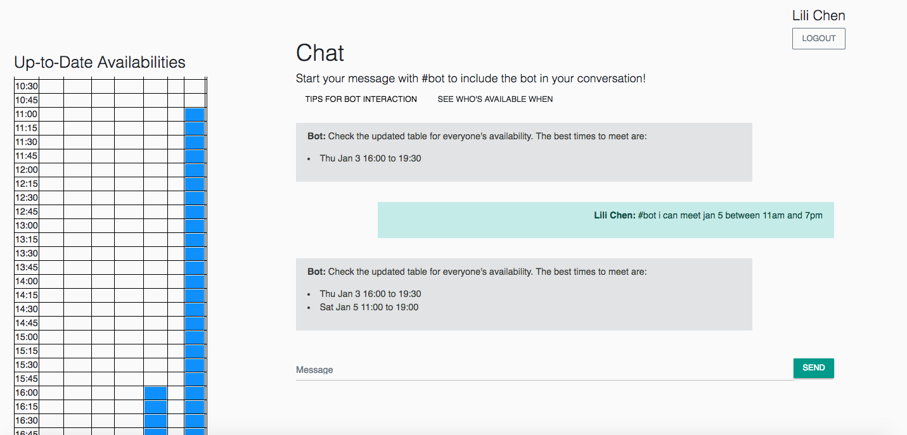

# Tabled: Group Chat Application with Intelligent Meeting Planner Bot

Group chat application featuring an intelligent meeting planner bot that places user availabilities into When2Meet style tables when prompted by natural language queries. For example, phrases like "I'm free Thurs 4pm to 7:30pm" instruct the bot to fill in the corresponding slots on the calendar, and the color gradient indicates the number of people available at a particular time. It then instructs everyone to check the updated table, and informs the group of the best times to meet based on everyone's inputted availabilities. Created using Node.js, Socket.io, Dialogflow, and MongoDB.

## Screenshots

